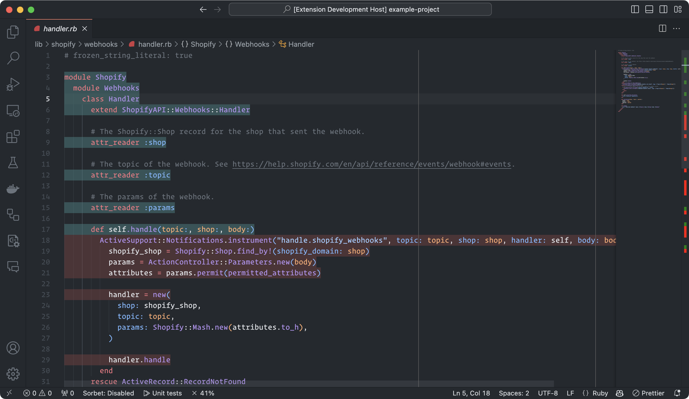
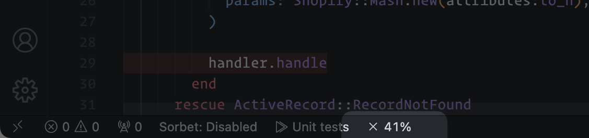

# SimpleCov - VS Code Coverage Highlighter

This extension provides a way to view your test coverage inline while in VS Code. After generating your test coverage report with SimpleCov, VS Code SimpleCov will parse the report and display the coverage inline in your editor:



The coverage is also displayed as a percentage in the editor's status bar:



> [!IMPORTANT]
> Initially ported from & heavily inspired by [vscode-go](https://github.com/golang/vscode-go) which I believe provides the best experience for viewing test coverage inline.

## Features

- View your test coverage inline while in VS Code.
- View your test coverage in the editor's gutter.
- View your test coverage percentage in the editor's status bar.
- SimpleCov's [Branch coverage](https://github.com/simplecov-ruby/simplecov?tab=readme-ov-file#branch-coverage-ruby--25) is supported.

## Configuration options

- `simplecov.coverShowCounts`: When generating code coverage, should hit & branch coverage counts be shown inline. Defaults to `false`.
- `simplecov.coverageOptions`: Use these options to control whether only covered or only uncovered code or both should be highlighted after generating a coverage report. Defaults to `showBothCoveredAndUncoveredCode`.
- `simplecov.coverageDecorator`: This option lets you style the way code coverage is displayed. Choose either to highlight the complete line or to show an indicator in the gutter.
  - `type`: Choose between `highlight` and `gutter`. Defaults to `highlight`.
  - `coveredHighlightColor`: The highlight color to use for highlighting covered code.
  - `coveredGutterStyle`: The style to use for the gutter indicator for covered code.
  - `uncoveredHighlightColor`: The highlight color to use for highlighting uncovered code.
  - `uncoveredGutterStyle`: The style to use for the gutter indicator for uncovered code.
  - `uncoveredBranchHighlightColor`: The highlight color to use for highlighting uncovered branches.
  - `uncoveredBranchGutterStyle`: The style to use for the gutter indicator for uncovered branches.


## Requirements

This VS Code extension requires that your Ruby project uses [SimpleCov](https://github.com/simplecov-ruby/simplecov) to generate your test coverage report.

If you are conditionally running SimpleCov, you will need to ensure that it is always run when VS Code is running.

```ruby
require "simplecov"

if ENV["CI"].present? || ENV["COVERAGE"].present? || ENV["REMOTE_CONTAINERS"].present?
  SimpleCov.start "rails" do
    enable_coverage :branch
    add_group "Components", "app/components"
    add_group "Mailboxes", "app/mailboxes"
  end
end
```

The extension will look for the SimpleCov profile at the following locations (and in this order):

- `coverage/.resultset.json`
- `coverage/coverage.json`

## Contributing

1. Fork it
2. Create your feature branch (`git checkout -b my-new-feature`)
3. Commit your changes (`git commit -am 'Add some feature'`)
4. Push to the branch (`git push origin my-new-feature`)
5. Create new Pull Request
